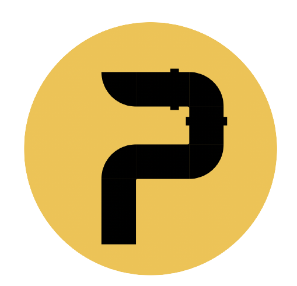

[![Contributors][contributors-shield]][contributors-url]
[![Forks][forks-shield]][forks-url]
[![Stargazers][stars-shield]][stars-url]
[![Issues][issues-shield]][issues-url]
[![MIT License][license-shield]][license-url]
[![LinkedIn][linkedin-shield]][linkedin-url]

 

  

  <h3 align="center">Pipe Web Monetization - Wordpress Plugin</h3>

  

    Monetize your Wordpress website with this codeless tool
     
    <a href="https://github.com/PipeWebMonetization/plugin-wordpress"><strong>Explore the docs »</strong></a>
     
     
    <a href="https://github.com/PipeWebMonetization/plugin-wordpress">View Demo</a>
    ·
    <a href="https://github.com/PipeWebMonetization/plugin-wordpress/issues">Report Bug</a>
    ·
    <a href="https://github.com/PipeWebMonetization/plugin-wordpress/issues">Request Feature</a>
  

<!-- TABLE OF CONTENTS -->

  
Table of Contents

  <ol>
    <li>
      <a href="#about-the-project">About The Project</a>
      <ul>
        <li><a href="#built-with">Built With</a></li>
      </ul>
    </li>
    <li>
      <a href="#getting-started">Getting Started</a>
      <ul>
        <li><a href="#prerequisites">Prerequisites</a></li>
        <li><a href="#installation">Installation</a></li>
      </ul>
    </li>
    <li><a href="#usage">Usage</a></li>
    <li><a href="#roadmap">Roadmap</a></li>
    <li><a href="#contributing">Contributing</a></li>
    <li><a href="#license">License</a></li>
    <li><a href="#contact">Contact</a></li>
    <li><a href="#acknowledgments">Acknowledgments</a></li>
  </ol>

<!-- ABOUT THE PROJECT -->

## About The Project

[![Product Name Screen Shot][product-screenshot]](https://example.com)

TODO: Write the about

(<a href="#top">back to top</a>)

### Built With

TODO: Write the built with

- [PHP](https://www.php.net/)
- [Wordpress](https://wordpress.org/)

(<a href="#top">back to top</a>)

<!-- GETTING STARTED -->

## Getting Started

### Docker

Use the `docker-compose.yml` to compose up your development environment.
The Docker image has 3 components:

- Wordpress
- MySQL Database
- PHPMyAdmin

### Volumes

The `src` directory maps to `/var/www/html/wp-content/plugins/pipewebmonetization` in the container, which allows you to directly edit the plugin without worring about the Wordpress installation or themes

### Wordpres

After composing the containers, navigate to `http://localhost:8000` and setup the Wordpress website

### Prerequisites

-[Docker](https://www.docker.com/get-started)

### Installation

TODO: Write installation

## Usage

TODO: Write usage

## Roadmap

- [x] Initial setup

See the [open issues](https://github.com/PipeWebMonetization/plugin-wordpress/issues) for a full list of proposed features (and known issues).

(<a href="#top">back to top</a>)

<!-- CONTRIBUTING -->

## Contributing

Contributions are what make the open source community such an amazing place to learn, inspire, and create. Any contributions you make are **greatly appreciated**.

If you have a suggestion that would make this better, please fork the repo and create a pull request. You can also simply open an issue with the tag "enhancement".
Don't forget to give the project a star! Thanks again!

1. Fork the Project
2. Create your Feature Branch (`git checkout -b feature/AmazingFeature`)
3. Commit your Changes (`git commit -m 'Add some AmazingFeature'`)
4. Push to the Branch (`git push origin feature/AmazingFeature`)
5. Open a Pull Request

(<a href="#top">back to top</a>)

<!-- LICENSE -->

## License

Distributed under the MIT License. See `LICENSE.txt` for more information.

(<a href="#top">back to top</a>)

<!-- CONTACT -->

## Core Team and Contact

<table>
  <tr>
    <td align="center"><a href="https://www.linkedin.com/in/andrey-torres-de-lima-8a6a8b145/"> <b>Andrey Torres</b></a>
    </td>
    <td align="center"><a href="https://www.linkedin.com/in/gabriel-muniz-piva-a7b380177/"> <b>Gabriel Piva</b></a></td>
    <td align="center"><a href="https://www.linkedin.com/in/danilomgusicuma/"> <b>Danilo Miranda</b></a></td>
    <td align="center"><a href="https://www.linkedin.com/in/gabrieltomonari/"> <b>Gabriel Eiji</b></a></td>
  </tr>
  
</table>

Project Link: [https://github.com/PipeWebMonetization/plugin-wordpress](https://github.com/PipeWebMonetization/plugin-wordpress)

(<a href="#top">back to top</a>)

<!-- ACKNOWLEDGMENTS -->

## Acknowledgments

(<a href="#top">back to top</a>)

[contributors-shield]: https://img.shields.io/github/contributors/PipeWebMonetization/plugin-wordpress.svg?style=for-the-badge
[contributors-url]: https://github.com/PipeWebMonetization/plugin-wordpress/graphs/contributors
[forks-shield]: https://img.shields.io/github/forks/PipeWebMonetization/plugin-wordpress.svg?style=for-the-badge
[forks-url]: https://github.com/PipeWebMonetization/plugin-wordpress/network/members
[stars-shield]: https://img.shields.io/github/stars/PipeWebMonetization/plugin-wordpress.svg?style=for-the-badge
[stars-url]: https://github.com/PipeWebMonetization/plugin-wordpress/stargazers
[issues-shield]: https://img.shields.io/github/issues/PipeWebMonetization/plugin-wordpress.svg?style=for-the-badge
[issues-url]: https://github.com/PipeWebMonetization/plugin-wordpress/issues
[license-shield]: https://img.shields.io/github/license/PipeWebMonetization/plugin-wordpress.svg?style=for-the-badge
[license-url]: https://github.com/PipeWebMonetization/plugin-wordpress/blob/main/LICENSE.txt
[linkedin-shield]: https://img.shields.io/badge/-LinkedIn-black.svg?style=for-the-badge&logo=linkedin&colorB=555
[linkedin-url]: https://linkedin.com/in/PipeWebMonetization
[product-screenshot]: images/screenshot.png
